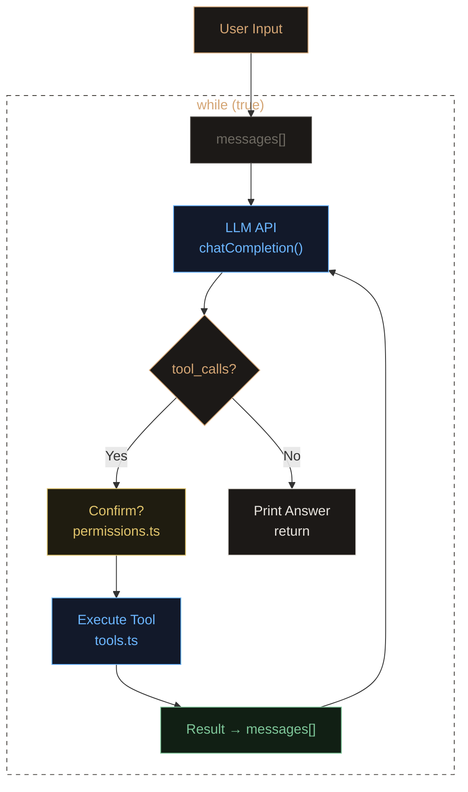

# Pocket Code

An educational agentic coding CLI that demonstrates how AI agent tools like [Claude Code](https://claude.ai/code) and [Codex CLI](https://github.com/openai/codex) work under the hood.

~900 lines of TypeScript. No magic, no frameworks — just the core agentic loop, laid bare.

[中文文档](README.zh-CN.md)

## How It Works



The agent runs in a loop: it sends your message to the LLM, the LLM decides which tools to call (read files, run commands, etc.), the results are fed back, and the loop continues until the LLM has enough information to answer.

Every step is visible in the terminal with color-coded output:

- Gray `[thinking]` — LLM reasoning
- Blue `[tool]` — Tool call with parameters
- Yellow `[confirm]` — Permission prompt (y/n)
- Green `[result]` — Tool execution result
- Red `[error]` — Errors
- White `[answer]` — Final answer

## Quick Start

```bash
npm install
npm run build

export LLM_API_KEY=your-api-key
node dist/index.js
```

Default model is `deepseek-chat`. To use a different provider:

```bash
node dist/index.js --model gpt-4o --base-url https://api.openai.com
```

Works with any OpenAI-compatible API: DeepSeek, Qwen, Ollama, etc.

## Built-in Tools

| Tool | Purpose | Needs Confirmation |
|------|---------|---|
| `read_file` | Read file contents | No |
| `write_file` | Create/overwrite file | Yes |
| `edit_file` | Partial string replacement | Yes |
| `list_dir` | List directory contents | No |
| `search_files` | Grep file contents | No |
| `run_command` | Execute shell command | Yes |
| `ask_user` | Ask user a question | No |

## Slash Commands

| Command | Action |
|---------|--------|
| `/model <name> [--base-url <url>]` | Switch LLM model |
| `/clear` | Clear conversation history |
| `/help` | Show help |
| `/exit` | Exit |

## MCP Support

Minimal [MCP](https://modelcontextprotocol.io) client (stdio transport only). Add a `pocket.json` to your project root:

```json
{
  "mcpServers": {
    "weather": {
      "command": "node",
      "args": ["./my-weather-server.js"]
    }
  }
}
```

## Project Structure

```
src/
├── index.ts          # Entry point, REPL, slash commands
├── agent.ts          # Core agentic loop
├── tools.ts          # 7 built-in tools
├── llm.ts            # OpenAI-compatible API wrapper
├── ui.ts             # Colored terminal output + spinner
├── permissions.ts    # User confirmation for write ops
└── mcp.ts            # Minimal MCP client
```

## Presentation

The `slides/` directory contains a reveal.js presentation that walks through the architecture. Open `slides/index.html` in a browser.

## Customization

Add a `POCKET.md` file to your project root to give the agent project-specific instructions (like CLAUDE.md for Claude Code). It will be prepended to the system prompt automatically.
